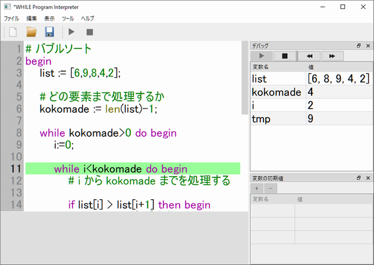
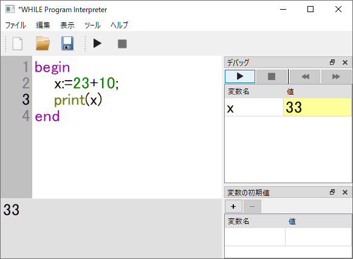
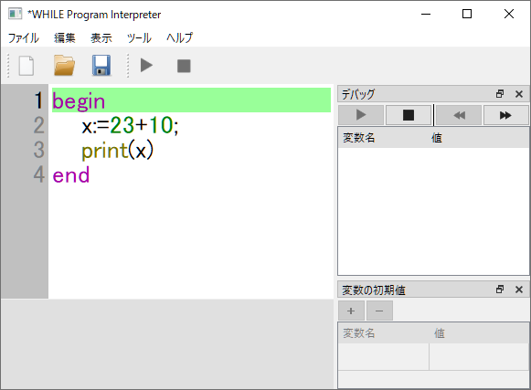
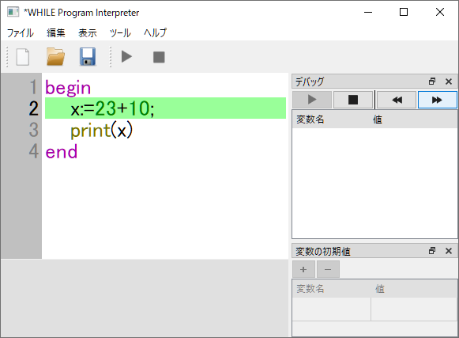
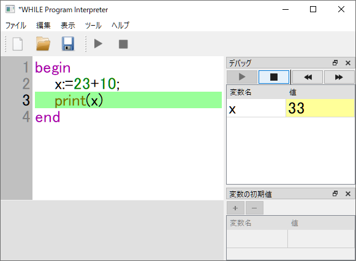
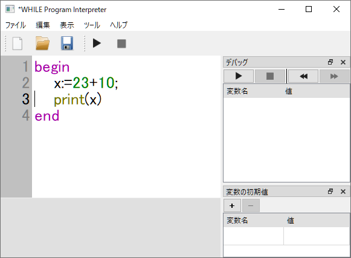
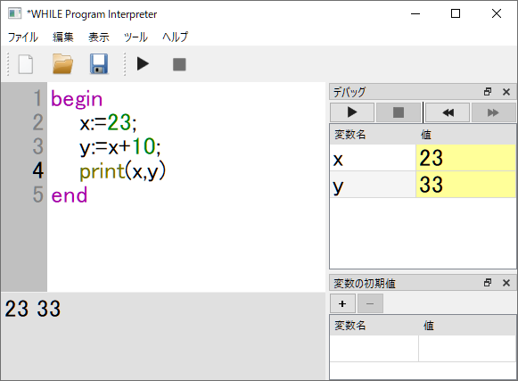

# whileプログラムのインタプリタ



これを使うと、書籍「チューリングの考えるキカイ ～人工知能の父に学ぶコンピュータ・サイエンスの基礎」
（阿部彩芽・笠井琢美 著、技術評論社）で仮想プログラミング言語として使われている whileプログラムが実行できます。なお、このインタプリタは書籍のファンである作者が勝手に作成したものであり、書籍の著者ら、出版社とはなんの関係もありません。

書籍のサイト：https://gihyo.jp/book/2018/978-4-7741-9689-3

## 特徴
- 実行結果がすぐにわかります！
  - プログラムを入力して実行ボタンを押すだけで、すぐに結果が表示されます。いろいろなおまじないは必要ありません。
  - 実行結果と一緒に変数の値も表示されます。print で表示しなくても簡単にわかります。

- 途中経過も簡単にわかります！
  - 1行ずつ実行できますので、実行過程が目で追えます。


## 必要環境

動作確認は以下の環境で行っています（Python3 はもっと低いバージョンでも動くと思います）：

- Windows 10(64bit), Python 3.7.7
- Ubuntu 20.04.2 LTS, Python 3.8.5

プログラムのソースは sources フォルダに入っています。Python3 にて MainWindow.pyw を実行してください：

```
python3 MainWindow.pyw
```

ソースの実行には Python ライブラリ PySide2、 PLY (Python Lex-Yacc) が必要です。
pip コマンドでインストールしてください：

```
pip install PySide2 ply
```

### Windows10 向け実行ファイル
Windows10(64bit)版向けにコンパイル済みの実行ファイルを用意しています。  
右側の「Releases」 v1.3.7 のリリースから while-v1.3.7-release-Win10-64bit.zip を入手し、展開してから  while-v1.3.7-release-Win10-64bit.exe をダブルクリックして使ってください。下記リンクからも入手できます：
https://github.com/sintan310/while-interpreter/releases/download/v1.3.7-release/while-v1.3.7-release-Win10-64bit.zip


# 使ってみましょう
アプリの画面には2つのテキストアリアがあります：
- 背景が白い方にプログラムを入力します。
- 灰色のものには実行結果が表示されます。

背景が白い方にプログラム ```print(23)``` を入力し、画面上部のツールバーにある ```▶``` ボタンを押して実行してみましょう。実行結果のところに ```23``` と表示されます。


なお、正しく入力されていないときにはエラーが表示されますので、訂正してもう一度 ```▶``` ボタンを押してください。  
複数の文を実行するときには複合文 begin ～ end を使います。例えば、変数 ```x``` に ```23+10``` の結果を代入し、``x`` の値を表示するには、例1のようにプログラムの行を ```;``` で区切って入力します。実行すると ```33``` と表示されるはずです。

例1
```
begin
    x:=23+10;
    print(x)
end
```


行頭の半角スペースは無くても結構ですが、begin ～ end で囲まれていることが分かりやすいように
インデント（字下げ）をすると良いです。Tabキーを押すと半角スペース 4文字分が自動的に入力できますので、インデントに便利です（Shift+Tab でインデントをキャンセルできます）。    

右側のデバッグドッグを使うと、1行ずつ実行できます。まず、「デバッグ」と書いてあるところにある実行ボタン ```▶``` を押し、デバッグモードにしてみましょう。



下図のように、「次に実行される候補」の行が緑色で表示されます：



デバッグモードでは、```◀◀``` ボタンと```▶▶``` ボタンで、実行を「実行前の行」に戻すこと、「背景が緑の行」を実行することができます。



```▶▶``` ボタンを何度か（この説明通りならば1回）押して、2行目を実行してみましょう。変数 x に 33 が代入されますので、「デバッグ」の「名前」「値」に ```x``` と ```33``` が追加されます。このように、デバッグモードではプログラム実行の経過が一つ一つ確認できます。


デバッグモード中はプログラム編集ができません。デバッグモードの終了は「デバッグ」と書いてあるところの ```■``` ボタンを押してください。デバッグモードが終了し、プログラム行が黄色で表示されて編集できるようになります。






print文で複数の変数の値を表示したいときには、カンマ ```,``` で区切って変数名を指定してください（例2）：


例2
```
begin
    x:=23;
    y:=x+10;
    print(x,y)
end
```



※プログラムの実行は、「実行」ボタンを押す代わりにキーボードショートカット Ctrl+Enter でも行えます。


# 書籍のプログラム表記との違い

#### 変数名:

- 変数名は ```x0```、```x1```、```x2```、... だけでなく、英字から開始する英数字が使えます。例えば、```a```、```a1```、```result``` などが使えます。

#### 代入、四則演算の記号：

- 演算子にはすべて半角記号を使います：
  - 代入記号は「←」の代わりに ```:=``` を使います。
  - 「≠」には ```!=``` を使います。 
  - 「＞」には ```>``` を使います。
  - 「≧」には ```>=``` を使います。
  - 「＜」には ```<``` を使います。
  - 「≦」には ```<=``` を使います。
- 四則演算には ```+```, ```-```, ```*```, ```div``` が使えます
（組み込み演算として実装しています）。また、割り算の余りには ```mod``` が使えます。

#### 文：

- 行中の # から右のものはコメントとして扱われ、プログラムとしては解釈されません。
- whileプログラムの文として「空文」を認めています。そのため、複合文
    ```begin s1;s2; ... ;sm end```  
    を、
    ```begin s1;s2; ... ;sm; end```  
    として書けます（つまり、最後の文 sm にセミコロンを付けてもエラーになりません）。
- whileプログラムの文は 1行で書いてください。行末に```\```を付けると次の行と同じ行として解釈されるようにしていますが、たくさんの文を書くときには複合文 begin ～ end を使いますので、begin ～ endの間は改行しても1行として解釈されるようにしています。

#### 配列：

- 配列には鍵かっこを使います。例えば、3,6,8 を要素とする配列は
  ```[3,6,8]```
  と書きます。

#### 文字、文字列：

- 文字、文字列は「"」で囲みます。例えば、文字列 hello は   ```"hello"```
  と書きます。文字列の同一性判定には ```=``` が使えます。
- 数値から文字列への変換には ```str``` 、文字列から数値への変換には ```int``` を使ってください（自然数しか扱えませんが、慣例的に ```int``` を使うことにしています）。
- 文字列の連結には「+」を使ってください。例えば、"abc" と "xyz" を連結する場合には、
 ```"abc" + "xyz"```
  と書きます。連結の結果は ```"abcxyz"``` となります。
  文字列と自然数を連結させるときには、自然数を文字列にしてから「+」で連結します。例えば、
  ```"abc"``` に  ```123``` を連結させるときには ```"abc" + str(123)``` と書きます。連結の結果は```"abc123"``` となります。
- 部分文字列取得には ```left```, ```right```, ```mid``` が使えます（組み込み手続きとして実装してます）：
    - ```left(str, n)```    str の左から n 文字を取得します。
    - ```right(str, n)```   str の左から n 文字を取得します。
    - ```mid(str, n, m)```  str の左から数えて n 文字目から m文字分を取得します。

```
begin
    moji:="abcdefg";
  
    x:=left(moji, 3);   # "abc" 
    y:=right(moji, 3);  # "efg"
    z:=mid(moji, 2, 4); # "bcde"

    print(x,y,z);  # "abc" "efg" "bcde" となるはず
end
```


- 文字列の長さ（文字数）の取得、配列の長さ（要素数）の取得:

  - 手続き ``` len``` を使ってください（組み込み手続きとして実装しています）。

```
begin
  # "abc" は3文字の文字列なので、x には 3 が代入される
  x:=len("abc");

  # 配列 [1,1,1,1] の要素数は 4 つなので、y には 4 が代入される
  y:=len([1,1,1,1]);

  print(x,y); # 3, 4 となるはず
end
```

#### 手続き：

- 書籍では手続きをマクロ（構文糖）として導入されていますが、いわゆる普通のプログラミング言語の「手続き」として実装しています。なお、書籍での動作と合わせるため、手続きの引数に変数を指定して呼び出すと、手続き内での変更が呼び出し元にも反映されるようにしてます。例えば、次に示す手続き呼び出し ```foo(x)``` によって、変数 ```x``` は ```11``` になります：

```
procedure z:= foo(a): begin
    a++;
    z:=a*10;
end

begin
    x:=10;
    z:=foo(x);
    print(x, z);  # 11, 110 になるはず
end
```

#### 手続き（つづき）:

- 手続きの引数として変数を指定すると、手続き内で行われた変更がその変数にも反映されますので、引数に与えられた変数の値を交換する手続き swap は次のようにして書けます：

```
procedure z:=swap(a,b): begin
    tmp:=a;
    a:=b;
    b:=tmp;
end

begin
    x:=1;
    y:=20;
    z:=swap(x,y);
    print(x,y);  # 20 1 となるはず
end
```


# プログラムのサンプル


## 引数の値を一つ増やす

```
# 引数に与えられた値を一つ増やす
procedure z:= oneUp(a): begin
    b:=a;
    b++;
    z:=b;
end

begin
    x:=100;
    z:=oneUp(x);
    print(z);   # 101 が表示されるはず
    print(x);   # 100 が表示されるはず

    # ちなみに、procedure は式として扱われるようにしてあるので
    # print の引数に指定して print(oneUp(200)) としても実行できる
    print(oneUp(200))
end
```


## 素数判定

```
# 素数判定
procedure  z:= isPrime(n): begin
    z:=1;
    w:=2;  # 2 から始めて n まで検査する
    
    while (w < n) and (z=1) do begin
  
        # 割り切れるときは素数でないので終了
        if (n mod w)=0 then z:=0;
        
        w++;
    
    end
end

begin
    z:=isPrime(3);
    print(z);       # 1 が表示されるはず
    
    z:=isPrime(4);
    print(z)        # 0 が表示されるはず
end
```


## n番目の素数を求める
```
# n が素数かどうかを判定する
procedure  z:= isPrime(n): begin
    z:=1;
    w:=2;
    while (w < n) and (z=1) do begin
        if (n mod w)=0 then z:=0;
        w++;
    end
end


# n 番目の素数を取得する
procedure  z:= getPrime(n): begin
    hit:=0;  # 素数を見つけた回数
    z:=2;
    
    while (hit < n) do begin
        z++;
        kekka:=isPrime(z);

        # z が素数ならば、素数ゲットで hit++
        if kekka=1 then hit++;
    end
end

begin
    z:=getPrime(5);
    print(z);       # 13 が表示されるはず
end
```


## チューリングマシン（単能）

命令表
|条件 |     |      | 動作 |     |
|---  | --- | ---  | ---  | --- |
|q0   | 1   | →   | q1   | ␣  |
|q1   | ␣  | →   | q2   | 右  |
|q2   | 1   | →   | q1   | ␣  |

テープの初期状態
|▷|1|1|1|
| --- | --- | --- | --- |

ヘッド位置:1（「▷」のところ）

ヘッドの内部状態:q0

```
# プログラム開始
begin
    # 初期状態の設定

    x0:=["▷", "1", "1", "1"];  # テープ
    h:=1;  # ヘッド位置
    q:=0;  # ヘッドの内部状態

    # 実行開始
    active:=1;  # ループの番人
    
    while (active=1) do begin
        print(x0, h, q);
        
        # テープ上の記号を読み込む
        kigou := x0[h];
        
        # 命令表に従った動作を行う
        if (q=0) and (kigou="1") then begin
            q:=1;  x0[h] := "␣" 
        end
        else if (q=1) and (kigou="␣") then begin
            q:=2;  h++ 
        end
        else if (q=2) and (kigou="1") then begin
            q:=1;  x0[h]:="␣" 
        end
        else  active := 0  # どれにも該当しないときは終了させる
    end
end


# 実行するとこのような出力になる
# ["▷", "1", "1", "1"] 1 0
# ["▷", "␣", "1", "1"] 1 1
# ["▷", "␣", "1", "1"] 2 2
# ["▷", "␣", "␣", "1"] 2 1
# ["▷", "␣", "␣", "1"] 3 2
# ["▷", "␣", "␣", "␣"] 3 1
# ["▷", "␣", "␣", "␣"] 4 2
```


## バブルソート

```
# バブルソート
begin
    list := [6,9,8,4,2];
  
    # どの要素まで処理するか
    kokomade := len(list)-1;
    
    while kokomade>0 do begin

        i:=0;
        while i<kokomade do begin
            # 0 から kokomade までを処理する
    
            if list[i] > list[i+1] then begin
                # list[i] の方が大きいので、i+1 の要素と取り換える
                tmp := list[i];
                list[i] := list[i+1];
                list[i+1] := tmp;
            end;
      
            i++;
        end;
    
        kokomade--;
    end;

    print(list)  # [2, 4, 6, 8, 9] になるはず
end
```


## リストの連結

```
procedure z:=append(a,b): begin
    length_a := len(a);
    length_b := len(b);
    
    z := a;
    i := 0;
    while i<length_b do begin
        z[length_a + i] := b[i];
        i++;
    end;
end

begin
    ret:=append([10,12], [4,5,6]);
    print(ret)  # [10,12,4,5,6] になるはず
end
```


## 階乗（再帰関数の例です）

```
# 階乗
procedure z:=fact(n): begin
    if n=0 then begin
        z:=1
    end
    else begin
         z1:=fact(n-1);
         z := n*z1;
    end
end

begin
    z:=fact(3);
    print(z)      # 6のはず
end
```


## クイックソート（リストを + で連結する簡単版）

```
procedure z:=quicksort(list): begin
    length := len(list);
    if length = 0 then begin
        z:=list;
    end
    else begin
        list1 := [];
        list2 := [];        
        pivot := list[0];
        
        i := 1;
        while i<length do begin
            val := list[i];
            if val < pivot then begin
                list1 := list1 + [val];
            end
            else begin
                list2 := list2 + [val];
            end;
            i++;            
        end;
        sorted1 := quicksort(list1);
        sorted2 := quicksort(list2);
        z := sorted1 + [pivot] + sorted2;
                                    
    end    
end


begin
    ret := quicksort([5,10,4,12,1,6]);
    print(ret)  
end
```


## クイックソート（append など自前で管理して苦労する版）

```
procedure z:=append(a,b): begin
    length_a := len(a);
    length_b := len(b);
    
    z := a;
    i := 0;
    while i<length_b do begin
        z[length_a + i] := b[i];
        i++;
    end;
end

procedure z:=quicksort(list): begin
    length := len(list);
    if length = 0 then begin
        z:=list;
    end
    else begin
        pivot := list[0];
        list1 := [];  list1_index := 0;
        list2 := [];  list2_index := 0;
        i := 1;
        while i<length do begin
            if list[i] < pivot then begin
                list1[list1_index]:=list[i];
                list1_index++;
            end
            else begin
                list2[list2_index]:=list[i];
                list2_index++;                
            end;
            i++;            
        end;
        sorted1 := quicksort(list1);
        sorted2 := quicksort(list2);
        z:=append(sorted1, [pivot]);
        z:=append(z,sorted2);
                                    
    end    
end


begin
    ret:=quicksort([5,10,4,12,1,6]);
    print(ret)  # [1, 4, 5, 6, 10, 12] になるはず
end
```


## whileプログラムのインタプリタ eval

```
#なお、与えるプログラムはあらかじめ構文木に変換しておく
# xi++ => ["incx", i]
# xi-- => ["decx", i]
# begin s1;...;sn end => ["multi", n, [s1,...,sn]]
# while xi != 0 do s  => ["while", i, s]

procedure z:=eval(s, env): begin

    # s[0] に文の識別子（"incx", "decx"、"multi", "while"）
    # が入っているので、それに応じた動作を行う
    
    if s[0] = "incx" then begin
        # 変数番号を取得
        index := s[1];
        
        # 環境を更新（++ の操作）
        env[index] := env[index]+1
    end
    else if s[0] = "decx" then begin
        # 変数番号を取得
        index := s[1];
        
        # 環境を更新（-- の操作）
        env[index] := env[index]-1
    end
    else if s[0] = "multi" then begin
        # 複合文の処理
        
        length := s[1];  # 文の個数
        multis := s[2];  # 文の取得
    
        # 複合文の実行
        i := 0;
        while i<length do begin
            env := eval(multis[i], env);
            i++;
        end;
    end
    else begin
        # while文の処理
        
        cond_index := s[1];  # 'while xi ...' の i を取得
        sentence := s[2];    # 文を取得
        
        # while文の動作を行う
        while env[cond_index] != 0 do begin
          env := eval(sentence, env);
        end;
    
    end;

    # 採取結果が含まれる環境 env を戻り値にする
    z:=env
end


begin
    # 初期条件
    # P  : x0++
    # x0 : 10

    env := [10];
    print(env);
    env := eval(["incx", 0], env);
    print(env);  # [11] になるはず
    
    
    # 初期条件
    # P  : while x1 != 0 do begin x1--; x0++; x0++ end
    # x0 : 0
    # x1 : 10
    
    env := [0,10];
    print(env);
    env := eval(["while", 1, ["multi", 3, [["decx", 1], ["incx", 0], ["incx", 0]]]], env);
    print(env);  # [20,0] になるはず
end
```


## スタック

```
# スタック構造
procedure z:=mkStack(): begin
    z:=[0,[0]]
end

procedure z:=isEmpty(s): begin
    if s[0]=0 then z:=1
    else z:=0
end

procedure z:=push(s,n): begin
    index := s[0];
    index++;
    vals := s[1];
    vals[index] := n;
    z := [index, vals];
end

procedure z:=pop(s): begin
    index := s[0];
    index--;
    z := [index, s[1]]
end

procedure z:=top(s): begin
    index := s[0]; 
    vals := s[1];
    z := vals[index] 
end


begin
    stack := mkStack();
    print(stack);  # [0, [0]]
    
    stack := push(stack, 100);
    print(stack);  # [1, [0, 100]]
    
    stack := push(stack, 38);
    print(stack);  # [2, [0, 100, 38]]
    
    z:=top(stack);
    print(z);  # 38
    
    stack := pop(stack);
    print(stack);  #  [1, [0, 100, 38]]  
      # 38 が残るが、参照先を示す stack[1] が 2 から 1 になっているので
      # スタック構造としては正しく機能できる

    z:=top(stack);
    print(z);  # 100  （このように、現在のトップに積まれている値が取得できる）
    
    z:=isEmpty(stack);
    print(z);  # 0
    
    stack := pop(stack);
    z:=isEmpty(stack);
    print(z);      # 1
    print(stack);  # [0, [0, 100, 38]] （ごみは残るが index が 0 であるため empty）
end
```


## 階乗（スタックを用いた再帰なし版）

```
# スタック構造
procedure z:=mkStack(): begin
    z:=[0,[0]]
end

procedure z:=isEmpty(s): begin
    if s[0]=0 then z:=1
    else z:=0
end

procedure z:=push(s,n): begin
    index := s[0];
    index++;
    vals := s[1];
    vals[index] := n;
    z := [index, vals];
end

procedure z:=pop(s): begin
    index := s[0];
    index--;
    z := [index, s[1]]
end

procedure z:=top(s): begin
    index := s[0]; 
    vals := s[1];
    z := vals[index] 
end


# 再帰なしの階乗
procedure z:=Fact(n): begin
    task := mkStack();
    retval := mkStack();
    
    # task スタックには [cnt, n] という形式で入れる
    # cnt は継続値（初期なら1, 2度目なら2）
    # n は、階乗計算の対象値（Fact(3) のときには n=3）
    task := push(task, [1, n]);
    sentinel := 0;
      
    while sentinel=0 do begin

        # タスクを一つ取得
        aTask := top(task);  
        task := pop(task);

        # 階乗計算の対象となる数を n に
        n := aTask[1];

        # 初期の処理(cnt=1)か、継続の処理(cnt=2)か
        cnt := aTask[0];
        if cnt=1 then begin
            if n=0 then      
                # 値用のスタックに 0! の結果である 1 を push
                retval := push(retval, 1)
	
            else begin
                # Fact(n-1) の後にもう一度処理（継続処理）させる
                task := push(task, [2, n]);

                # Fact(n-1) のために、新たなタスクを push する
                task := push(task, [1, n-1]);
            end
        end
        else begin
            # 継続処理用

            # 値用のスタックから一つ取得
            # なお、z1 には Fact(n-1) の結果が入っている
            z1 := top(retval);  retval := pop(retval);

            # 階乗を計算し、値用のスタックへ push しておく
            z := n * z1;
            retval := push(retval, z);
        end;

        # タスクスタックが空っぽなら終了
        sentinel := isEmpty(task);
    end;

    # 値用スタックに積んである結果を一つ取得し、戻り値にする
    z := top(retval)
end


# 実行
begin
    z:=Fact(4);
    print(z)     # 24 になるはず
end
```


# ライセンス

このディレクトリに含まれるソースコードは
佐藤伸也が著作権を保持し、MITライセンスのもとで配布します。
コピー、配布、変更、再配布、商用利用など、ご自由に使ってください。
このソフトウェアにはなんの保証もついてきませんので、
利用したことで何か問題が起きたとしても作者はなんの責任も負いません。

佐藤伸也 / Shinya Sato
